## 计算机毕业设计Hadoop+Hive+PySpark小说推荐系统 小说可视化 小说爬虫 大数据毕业设计(源码+LW文档+PPT+详细讲解) 


## 要求
### 源码有偿！一套(论文 PPT 源码+sql脚本+教程)

### 
### 加好友前帮忙start一下，并备注github有偿最新hadoop小说
### 我的QQ号是2827724252或者798059319或者 1679232425或者微信:bysj2023nb

# 

### 加qq好友说明（被部分 网友整得心力交瘁）：
    1.加好友务必按照格式备注
    2.避免浪费各自的时间！
    3.当“客服”不容易，repo 主是体面人，不爆粗，性格好，文明人。

## 演示视频

https://www.bilibili.com/video/BV1oRRiYVEXF/?spm_id_from=333.1387.homepage.video_card.click

## 截图
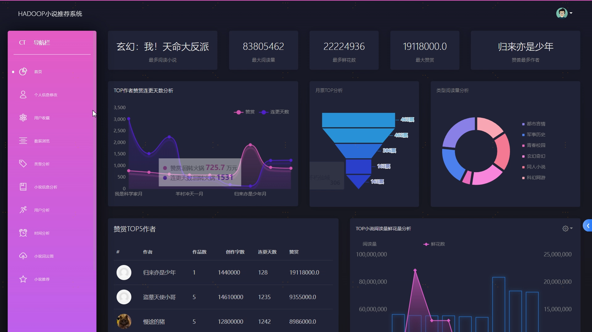
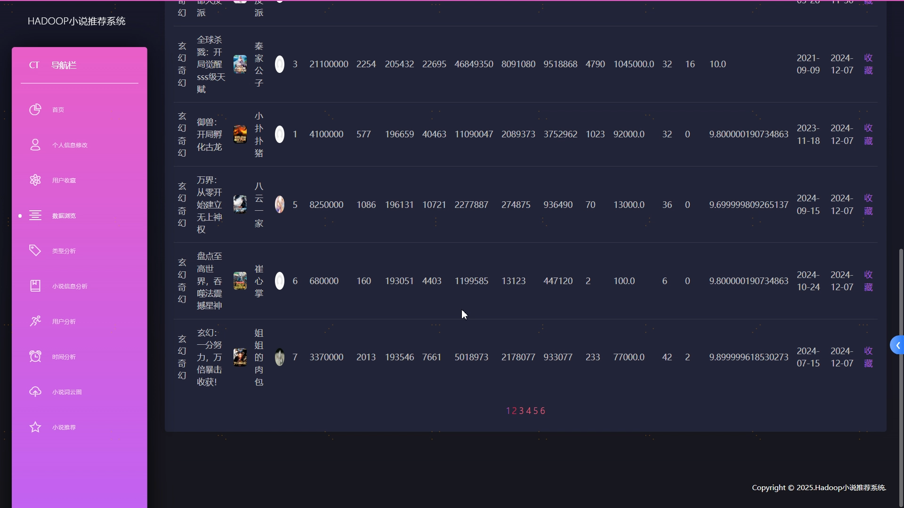
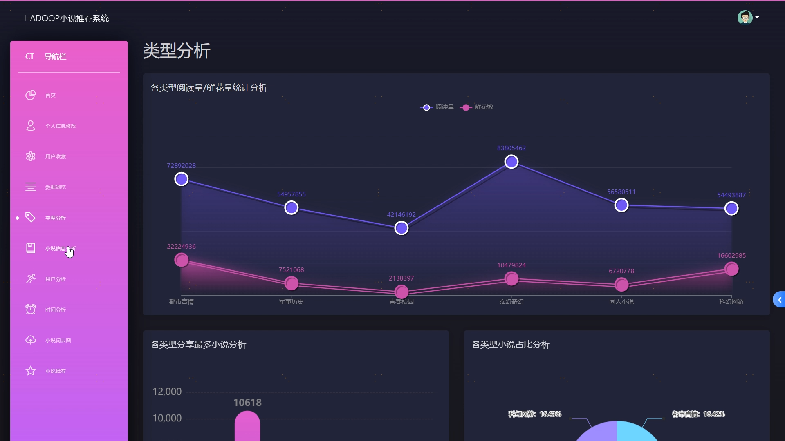

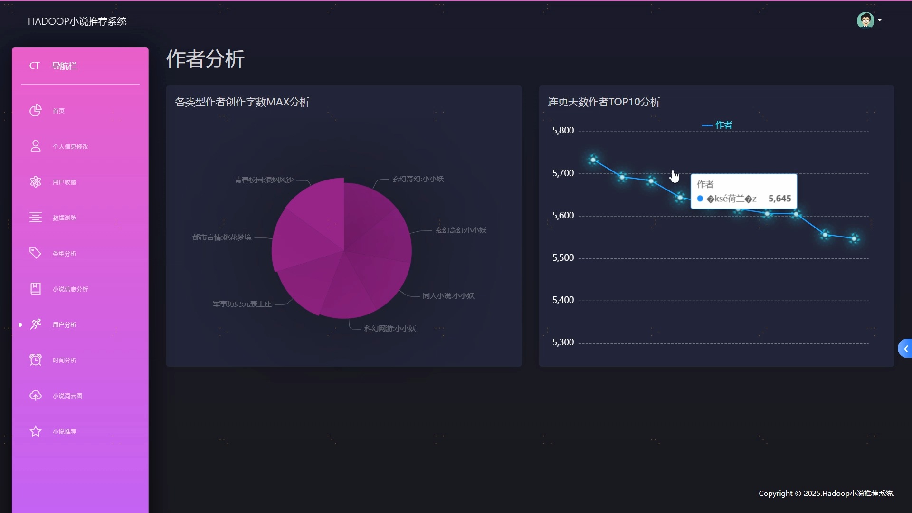
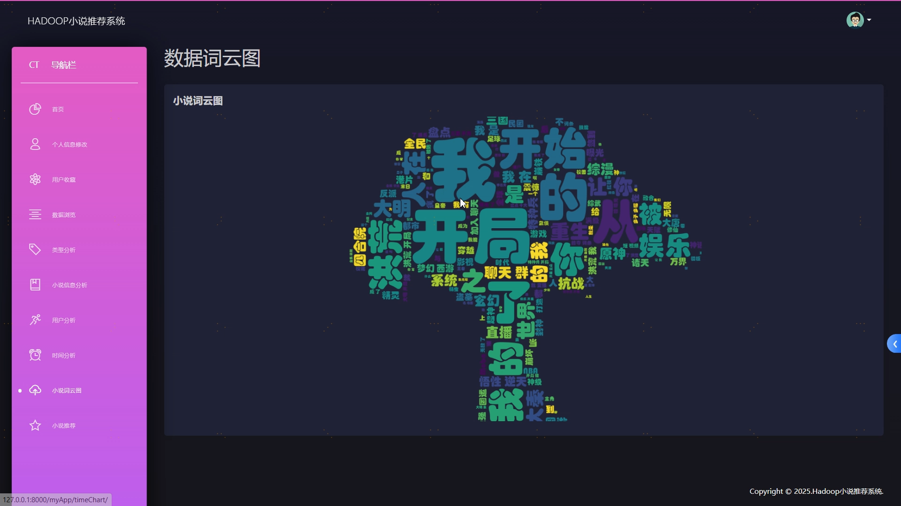
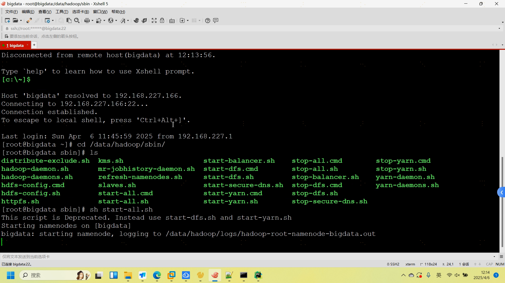
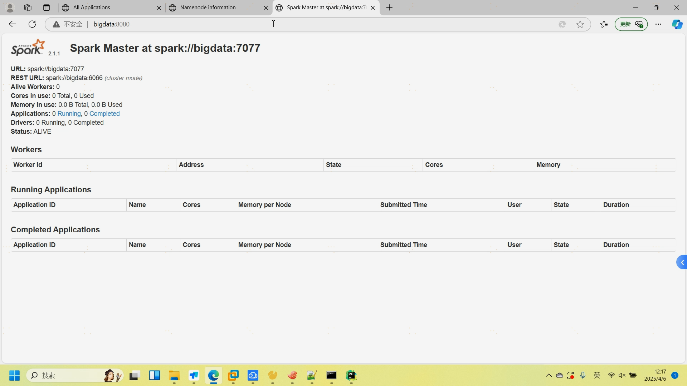
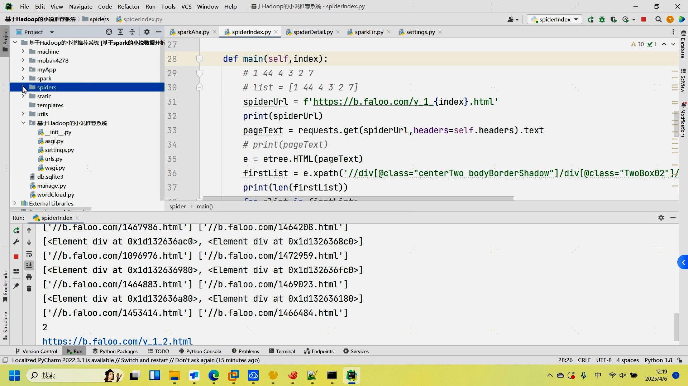
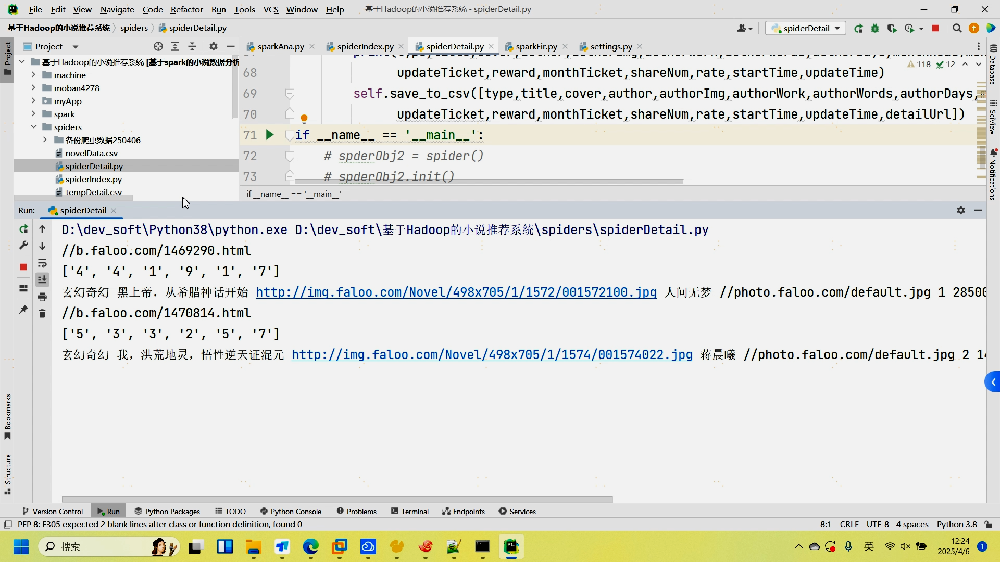
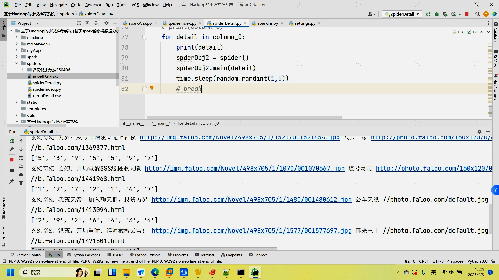
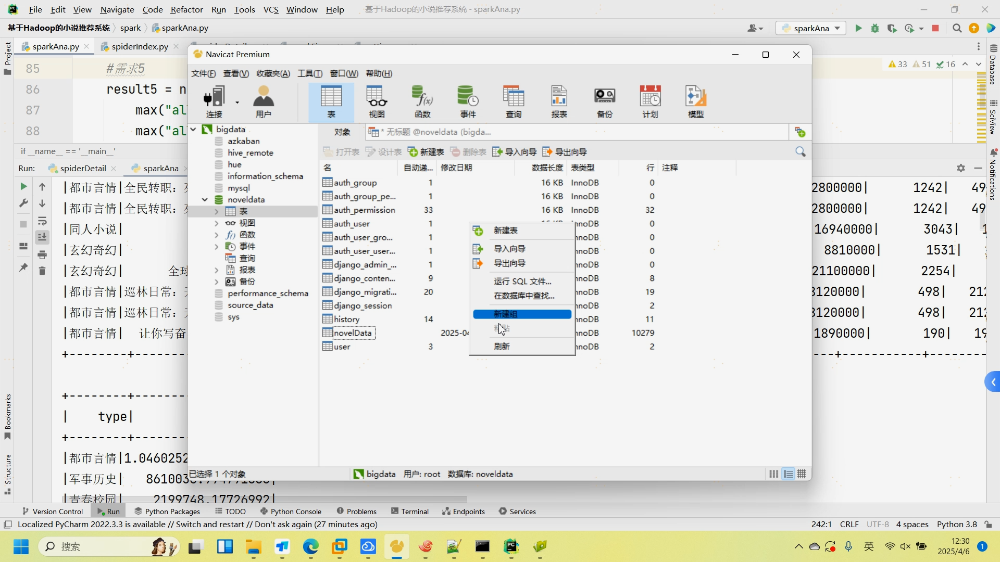

## 介绍(技术框架 创新点 装逼点)
基于Spark+hadoop大数据小说数据分析推荐系统（完整系统源码+数据库+开发笔记+详细部署教程+虚拟机分布式启动教程）

✅️直拍源码 包部署
✅️爬虫可用
✅️基于用户协同过滤算法

## **开发技术介绍**

```
编辑器：Pycharm
前端框架：HTML，CSS，JAVASCRIPT，Echarts
后端：Django
数据处理框架：Spark
数据存储：HIVE
编程语言：Python
数据可视化：Echarts
```

```
基于Spark和Hadoop的大数据小说推荐系统！
这可不是普通的项目，它简直就是数据处理和个性化推荐的神器！
为啥这么说呢？首先，它利用了Hadoop强大的分布式存储和计算能力，结合Spark的高效数据处理速度，能够快速分析海量小说内容和用户行为数据。这就意味着，无论是多大的数据量，它都能轻松搞定，效率杠杠的！
而且，它还采用了协同过滤等机器学习算法，能精准挖掘用户喜好，实现个性化推荐。想象一下，用户在海量小说中，能快速找到自己真正喜欢的内容，这体验感直接拉满！
更厉害的是，它还具备数据可视化展示功能，通过Echarts等工具，将关键数据以直观的图表形式展示给平台运营人员，辅助决策制定。这就相当于给运营人员装上了一双“透视眼”，轻松掌握平台的运行情况。
宝子们，这样的项目，是不是让你眼前一亮？如果你也在搞数据处理，或者对个性化推荐感兴趣，那这个项目绝对值得你深入研究。快去试试吧，说不定它就是你开启新世界大门的那把钥匙呢！
```


